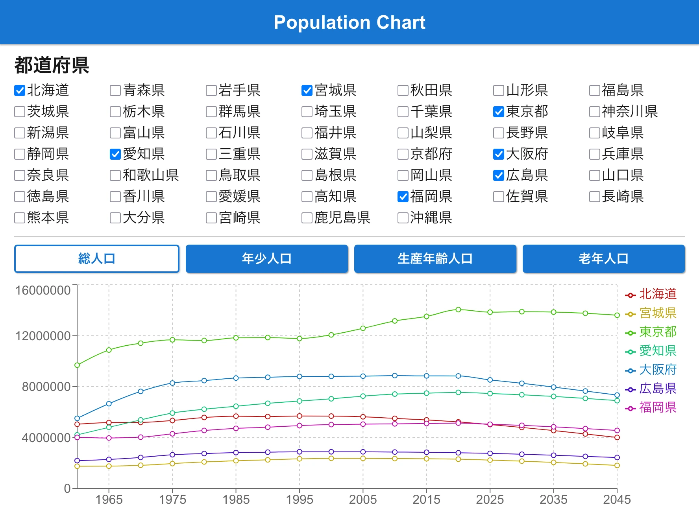
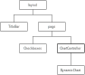
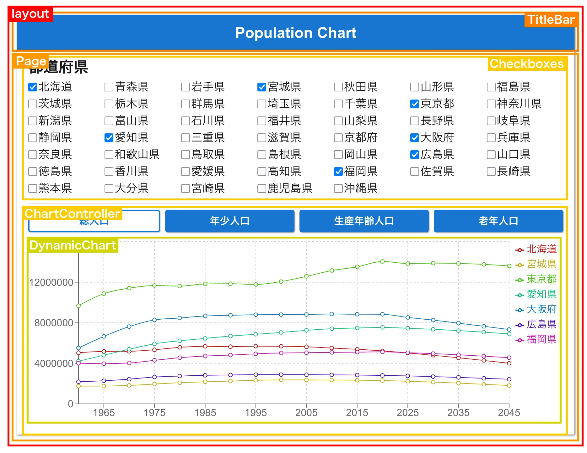
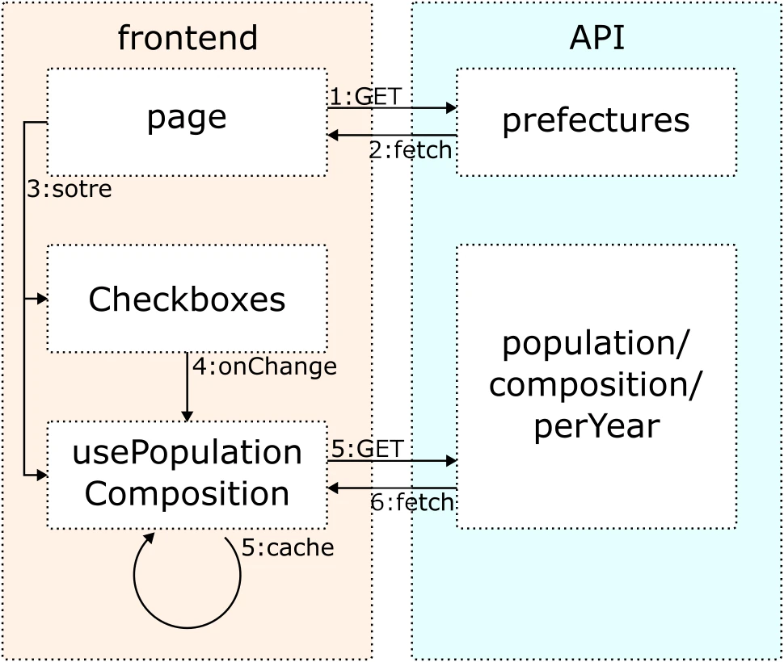

# population-chart

## 概要
都道府県別の総人口推移グラフを表示するSPAです．
[株式会社ゆめみのフロントエンドコーディング試験](https://yumemi.notion.site/0e9ef27b55704d7882aab55cc86c999d)です．

### 要件
- ゆめみフロントエンドコーディング試験 API の「都道府県一覧」API から取得する．
- API レスポンスから都道府県一覧のチェックボックスを動的に生成する．
- 都道府県にチェックを入れると，ゆめみフロントエンドコーディング試験 API から選択された都道府県の「人口構成」を取得する．
- 人口構成 API レスポンスから，「X 軸: 年」「Y 軸: 人口数」の折れ線グラフを動的に生成して表示する．
  - 「総人口」の他に「年少人口」「生産年齢人口」「老年人口」も切り替える UI を何かしらの形で用意し，表示できるようにすること．（同時に表示する必要はない）

## デプロイ
Vercelでデプロイしています．

https://population-chart-kulthe85o-tsuyopon1067s-projects.vercel.app/

## 仕様
### コンポーネント構成

### データの流れ

## 実装時間
[こちら参照](./doc/time.md)

## 実装内容
[こちら参照](./doc/doneList.md)